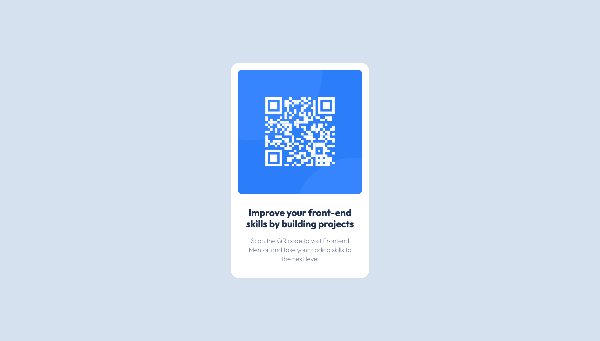

# Frontend Mentor - QR code component solution

This is a solution to the [QR code component challenge on Frontend Mentor](https://www.frontendmentor.io/challenges/qr-code-component-iux_sIO_H). Frontend Mentor challenges help you improve your coding skills by building realistic projects.

## Table of contents

- [Overview](#overview)
  - [Screenshot](#screenshot)
  - [Links](#links)
- [My process](#my-process)
- [Author](#author)

## Overview

### Screenshot

### Links

- Live Site URL: [https://madroosterlab.github.io/FEM-QrCode](https://madroosterlab.github.io/FEM-QrCode)

### My process

Short and Sweet

## Author

- Website - [madroosterlab.com](https://www.madroosterlab.com)
- Frontend Mentor - [@madroosterlab](https://www.frontendmentor.io/profile/madroosterlab)
